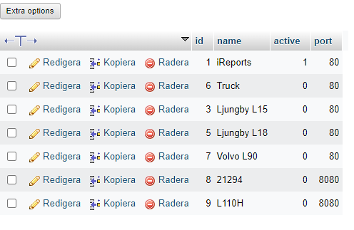

# AIMPSPP
*Automatisk Installation av MPS på Produktions-Plattor*

Byggt av Tor Smedberg under praktik på Stena Recycling 2022-2023

Underhåll av Richard Johansson på Stena Recycling 2023

Små ändringar av Sixten Paulsson under praktik på Stena Recycling 2023

## Instruktioner
1. Håll inne windows-tangenten på skärmen, eller tryck på windows + x
2. Välj **Windows Powershell (Administratör)** och godkänn UAC
3. Kör kommandot `Set-ExecutionPolicy RemoteSigned` (ej skiftlägeskänslig) och skriv in `y+enter` för att godkänna
   * Kan alternativt köras med flaggan `-Scope Process` som gör att dessa ändringar slutar gälla när PowerShell-fönstret avslutas
4. Navigera till den här mappen på usb-minnet, t.ex. `cd D:\AIMPSPP`
5. Starta skriptet med kommandot `.\surfaceconfig.ps1`
6. Svara på frågorna som skriptet ställer.
7. FTDI-drivrutinerna behöver installeras manuellt. Stega igenom guiden för det.
8. Starta om plattan (stäng av funkar inte)

### PMR
PMR har speciella portar baserade på vilken lastare det gäller, så det måste konfigureras manuellt i `C:\AITECH\mps\MPS-COM.conf`

Ändra nedan markerade värde till port i bilden ovan

## För att ändra på inställningar
Giltiga alternativ och standardvärden finns definierade i filen `variables.ps1`.
Ändringar på `$hostnameLookup`, `$portLookup`, och `$scaleTypes` måste även ändras i GUIt, se nedan.

För att ändra hur en specifik avdeling installeras ska ändringar göras i `surfaceconfig.ps1`. Alla funktioner som används finns i filen `functions.psm1`.
#### Skapa ny avdelning
Ny avdelning måste läggas till under `$divisions` i `variables.ps1`. Om avdelningen har speciella steg kan funktionerna läggas till i `functions.psm1` och anropas i ett nytt if-block i `surfaceconfig.ps1`.
För att nya avdelningar ska funka i GUIt ska de läggas till i `config.json`. Kopiera instruktionerna från en annan avdelning.
Om avdelningen ska ha annan host och port än `127.0.0.1:80` ska det läggas till under `$hostnameLookup` och `$portLookup` i `variables.ps1` och för GUIt under `hostnames` och `ports` i `config.json`
#### Lägg till ny vågtyp
Ny vågtyp läggs till under `$scaleTypes` i `variables.ps1` och i GUIt under `validScales` och `defaultScales` i `config.json`
### GUI
När ändringar görs i GUI-projektet måste det kompileras på nytt. Välj läge `Release` i Visual Studio. Färdigt program hamnar i `bin\Release`.
Ändringar i `surfaceconfig.ps1` är ekvivalenta med ändringar i `MainWindow.xaml.cs` och `config.json` kombinerat.
Ändringar av tidigare nämnda standardvärden samt standard vågtyp per avdelning görs i `config.json`.
Alla filer och mappar som behövs från detta projekt för GUIt är
* `copy`
* `files`
* `layouts`
* `shortcuts`
* `functions.psm1`
* `variables.ps1`
Dessa kopieras så att de ligger "bredvid"/på samma nivå som exe:n, i mappen `Release`
## Förklaring av filer
* `copy` - Filer som kopieras till `C:\Stena`, i nuläget konfigurationen för bginfo, samt bginfo självt.
* `files` - Installationsprogram som används, t.ex. Chrome, FTDI-drivrutiner, MPS, etc
* `layouts` - Layouter för aktivitetsfältet, nya kan genereras med `Export-StartLayout` i PowerShell
* `shortcuts` - Genvägar som läggs i autostart
  - `common`- Innehåller genvägar som är gemensamma för **alla** installationer
  - Om en avdelning behöver specifika genvägar kan en mapp med avdelningsnamnet läggas till
* `functions.psm1` - Alla funktioner som skriptet använder, används också i GUIt
* `readme.md` - Den här filen
* `releasenotes.md` - Anteckningar om nyheter för olika versioner av skriptet
* `removewifiblock.ps1` - Skript för att ta bort den gamla versionen av WiFi-blockering, där **alla** SSIDn förutom `SM-IoT` blockerades.
  * Körs genom att skriva `.\removewifiblock.ps1` i ett PowerShell-fönster som administratör
* `surfaceconfig.ps1` - Huvudskriptet, se även kommandoradsväxlar
* `variables-ps1` - Alla alternativ och standardvärden

## Kommandoradsväxlar
`-ShowVersion` Visar versionsinfo och avslutar

`-Division <String>` Specificera avdelning, om ospecificerat frågar skriptet användaren

`-NoRestorePoints` Skapa ej återställningspunkter

`-Hostname <String>` Specificera hostname, går före standardvärden

`-Port <Int>` Specificera port på webbservern, går före standardvärden

`-ScaleType <String>` Specificera vågtyp, om ospecificerat frågar skriptet användaren

`-SSID <String>` Specificera SSID på WiFi, standard är `SM-BYOD`

`-PSK <String>` **OSÄKERT** Specificeras lösenord till WiFi, om ospecificerat frågar skriptet användaren

`-Force` Skriver över befintliga filer utan att fråga användaren

### Kontaktuppgifter
* [Github](https://github.com/tsmedberg)
* tor.smedberg snabel-a gmail.com
* [tsmedberg.se](https://tsmedberg.se)
